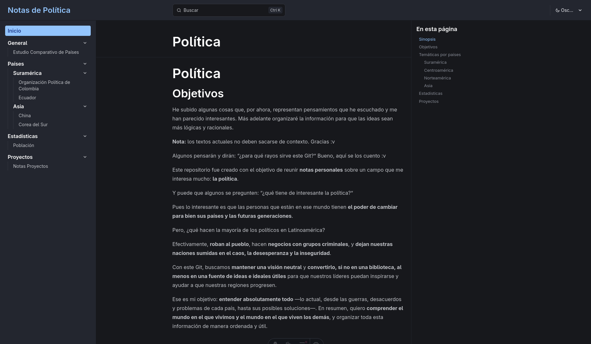

# Political Notes

[Version en español](./README.md)

Personal notes repository about politics built with [Astro](https://astro.build) and [Starlight](https://starlight.astro.build).



## Features

- **Light/dark theme**: Built-in selector in the navigation bar (light, dark, automatic)
- **Sidebar**: Visible on all pages, including the main one
- **Search**: Search index with Pagefind
- **Navigation**: Organized by sections (General, Countries, Statistics, Projects)
- **Responsive**: Layout adapts to mobile and desktop

## Project structure

```
/
├── public/                 # Static assets
│   ├── favicon.svg
│   └── screenshot.png      # Social media preview image
├── src/
│   ├── content/
│   │   └── docs/           # Markdown content
│   │       ├── index.md    # Main page
│   │       ├── general.md  # Comparative study
│   │       ├── paises/
│   │       │   ├── suramerica/  (colombia, ecuador)
│   │       │   └── asiaticos/   (china, corea-del-sur)
│   │       ├── estadistica/
│   │       │   └── poblacion.md
│   │       └── proyectos/
│   │           └── general.md
│   ├── styles/
│   │   └── custom.css      # Theme colors
│   └── content.config.ts
├── astro.config.mjs
└── package.json
```

## Technologies

| Technology | Use |
|------------|-----|
| [Astro](https://astro.build) | Web framework |
| [Starlight](https://starlight.astro.build) | Documentation theme |
| [Pagefind](https://pagefind.app) | Search (included in Starlight) |
| pnpm | Package manager |

## Content

- **General**: Comparative study between Colombia and reference countries
- **Countries**: Notes by region (South America, Asia)
- **Statistics**: Population data and more
- **Projects**: Ideas, advice and proposals

## Information

**License:** Apache 2.0

**Author:** Fravelz
